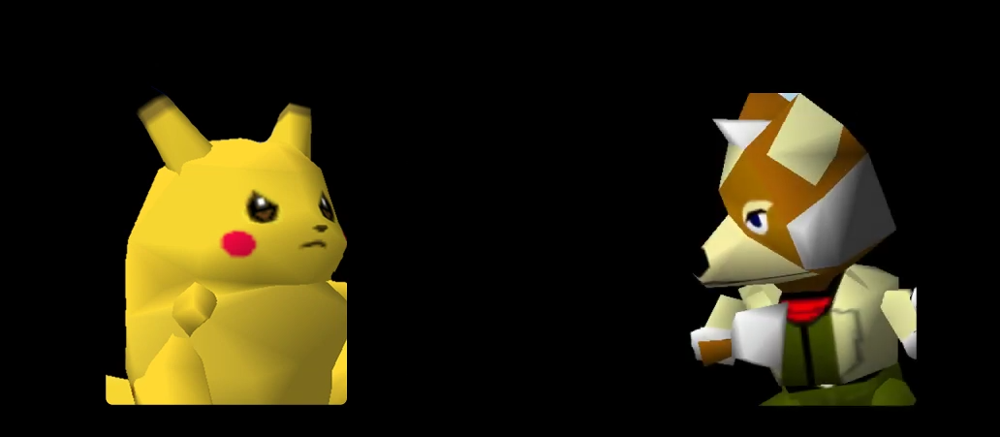

### Overview

Fox and Pikachu share many attributes: both are fast, mid-weight characters with a plethora of kill and combo options. What sets them apart is their weight and recovery: Fox falls fast, making him difficult to kill off the top, but has a weak recovery that can be exploited even at very low percents, while Pikachu's floatiness makes him vulnerable to kills in every direction, but his incredible recovery gives him untouched survivability off-stage. 

With these differences in mind, we have gameplans for both sides: Fox will try to quickly build up damage and kill with one of his powerful vertical finishers, while Pika will try to get Fox offstage as quickly and often as possible and exploit his vulnerable recovery.

### Stage Positioning

Both Fox and Pikachu have fast dash dances and and multitude of good grounded options, paired with long, disjointed uairs that make fighting them from above very dangerous. For this reason, both characters will usually prefer to fight on the ground, and look to force the opponent to use his double-jump or flee to platforms. However fighting from height can occasionally be useful, especially for Fox at very low percents when Pikachu's uair is too weak to knock him down, and for Pikachu at mid percents, where Fox's uair will knock him too far to combo but not far enough to kill.

On the ground Pikachu, who relies mostly on edgeguarding, will be especially focused on trapping Fox in a corner, where a hit or grab can easily convert into a kill. Fox mostly needs to worry about avoiding that fate in his positioning, since his combos are flexible enough to begin from anywhere on the stage. 

### Moves to look for
#### Pikachu:

Pikachu is mostly concerned with which moves will set up a grab, his main offensive tool in the matchup.

When Fox is at **low percents**, low aerials like falling bair and dair can combo into grab and setup for early kills. Lower-damage moves like utilt and uair (from below or facing away) are less reliable, and good Fox players will usually shield jump away or even counter-attack. Falling [forward-facing uair](https://youtu.be/95RIIXN5awI?t=203) can be effective if spaced well. Dtilt is good if landed and can anti-air Fox's fair, but Fox can easily bait it and outrange it with their own dtilt, so it's not usually effective. 

Once Fox is at **mid percent**, aerials like dair, bair, and nair will still be strong, especially near the ledge, but will now setup tech-chases instead of guaranteed grabs. Pikachu's uair and utilt become much more deadly, and can frequently convert into kills. Utilt is an especially important option in neutral since it [can anti-air](https://youtu.be/HivvYtU8984?t=41) many of Fox's best neutral options, but it's also very easy for a good Fox to bait and punish. Mixing in utilts with pivots and dash dancing is critical for dealing with Fox on the ground.

Getting Fox to **high percent** is much less important for Pikachu than in other matchups, since he doesn't gain many new kill options, and Fox's recovery benefits from the added height he gets from being thrown at higher percents. Fthrow can sometimes be better than backthrow here for this reason.

#### Fox:

Depending on his confidence in his combos and his opponent's DI, Fox can choose to fish heavily for his combo starters, especially uair and utilt, or he can focus on just racking up damage quickly and then looking for one of his many kill options.

At **all percents** Fox should be cautious and purposeful in his use of laser. Pikachu's run keeps him low to the ground, letting him easily [rush in and grab](https://youtu.be/_YuNHbVqOmQ?t=137) a Fox short-hop double lasering carelessly. However, well placed lasers can heavily disrupt Pika's otherwise threatening short-hop aerials. 

Many of Fox's moves otherwise strong moves are ineffective at **low percents** because of their low knockback, especially bair, fair, and utilt. This limits his options somewhat when Pikachu has a fresh stock. Uair can be risky to use when rising because of its ending lag, but a falling uair against a grounded Pikachu makes for a great combo starter. Dtilt is also effective as a combo starter; although the potential risk of missing with it is high, it can be used to punish Pika whiffing utilts or grabs. Fox's forward throw, which is usually unimpressive in the matchup, can be used at low percents onstage to setup techchase situations. After fthrowing Pikachu onto the other side of the stage, Fox can follow up with a regrab into another tech chase, or attempt to [read Pikachu's tech with a falling uair](https://youtu.be/SPX9cvfIagY?t=5) to start a combo. 

Almost Fox's entire moveset is useful against Pikachu at **mid percents**, and he has a lot of room to adjust his playstyle to his preference and his opponent. Utilt, dtilt, and uair are all great combo starters, usually setting up vertical combos to the platforms into usmash. Fox can also combo Pikachu horizontally using fair, usually ending in a jab to usmash or offstage fair to nair to kill. Although it's not as effective as a combo starter, Fox's bair is a fantastic air-to-air thanks to its long reach and lingering disjointed hitbox, and can be used to wall out Pika's aerial approaches. However, it's very susceptible to being anti-aired by Pika's utilt, so Fox should be careful and mix up his aerial drift to avoid getting caught. On the ground, Fox's jab is very effective at winning close-up fights and stopping dashes in from Pika. It's also a great move mid-combo and can be used to convert from, for example, fair to jab to usmash, when [fair straight to usmash](https://youtu.be/SrUl5ewQW_o?t=142) wouldn't connect. 

Fox's jab usmash is a very easy to land finisher at **high percents**, since Fox's jab is frame 3 and has great range. Dair to jab is a common way to land it, but be careful about hitting with all of the hits of dair, since good players can sometimes DI out and counterattack. Since jab combos into itself on Pikachu, Fox can [throw in multiple jabs](https://youtu.be/L0Wc_2QC0B0?t=84), walking forward in between them if necessary to build up damage and ensure the usmash will kill. Fox can also kill with raw usmash, notably out of techchase situations that can be started with dash attack or fair/bair. 

At **very high percents** jab will no longer combo into usmash against Pika, but Fox can simply switch to using nair (also good if the jab hits Pika offstage) or uair, the latter of which is also easy to hit raw, especially during edgeguards.

### Shield Play

Thanks to his fast utilt, high-damage aerials, long-range jab-grab, and fantastic throws, Pikachu has some of the best shield pressure in the game, rivaling even characters with shield-breaking combos. His own shield is hard to poke, his shieldgrab is great, and his nair and up-b grant him flexible and safe OoS options. Meanwhile few of Fox's moves are even fully safe on shield, with only falling uair effectively converting into grab, which itself is usually ineffective against Pikachu. 

As you might expect, these two characters need to approach shielding in the matchup very differently. Pikachu can use his shield liberally to help deal with Fox's often relentless pressure, and if he's precise with his shield-grabs and nairs out of shield, can frequently get big openings. Especially vulnerable are dairs and [repeated jabs](https://youtu.be/hbjZrwAFFtA?t=90) from Fox, both tempting options that can be shield-grabbed with good timing. Nair OoS can be used to deal with Fox pressuring shield from behind, but should be used cautiously at low percents, since it won't knock down, especially if Fox crouch cancels it.* Uair OoS can be effective against shield pressure from the back, but its similarly low knockback makes it unreliable at low percents. 

For his part, Fox has a variety of ways to deal with a Pikachu holding Z. The simplest is to simply grab him as much as possible. Fox's dash grab is generally too fast to react to, so it's an easy way to discourage Pika from shielding. Unfortunately it's very difficult to capitalize on at mid percents, but it will slowly build up damage. Fox has a few options if he wants to be more aggressive, relying on outranging or avoiding Pika's OoS attacks. If spaced well, Fox's jab and dtilt outrange Pika's shieldgrab, and can be alternated to slowly wear away at Pika's shield. This is far from true pressure, but Fox's great mobility gives him chances at catching Pika's inevitable jump or roll away. Fox can also attempt to cross over behind Pika, to avoid shieldgrab, to confuse, or just to be flashy, either with a cross-up aerial (usually falling uair) or with [a quick pivot after hitting Pika's shield](https://youtu.be/icCxyV_YPWY?t=337) with a jab or dtilt.
### Getting off the ledge

Ledgeplay is another area where Pika has a huge advantage. While Fox has decent options there, he's only a single mistake away from death, and has to be very aware of which options Pika is covering if he wants to survive at all. Pikachu meanwhile has some of the best ledge options in the game, and usually doesn't have to worry about dying even if he does get caught.
#### Pikachu on Ledge

Fox players are usually pretty scared of a reversal when Pikachu is on the ledge, and will often stand so far into stage that Pika can do whatever he wants. In that case it's fine for Pika to simply neutral getup, since jumping makes him more likely to eat some lasers. But Pika shouldn't be too worried even if Fox decides to stand closer and apply some pressure. Pika's [aerials to side plat](https://youtu.be/A3Smg4MNWuA?t=35) are pretty strong in every matchup, but they're especially good against Fox, who lacks good shield pressure in that position. If Pikachu feels threatened, he can simply [up-b to ledge](https://youtu.be/7I4CT028RdY?t=288) and try again, often catching the Fox by surprise. Although dair is usually the go-to aerial from ledge, fair can work well against Fox too, since its forward range is a bit deceptive. 

If Fox seems ready for a jump, or Pika just wants to mix it up, normal ledge get-up is usually fine as well. Against weaker or auto-piloting Foxes, neutral getup to immediate utilt can be extremely effective, since it will beat out the sh aerials Foxes love to do. Of course it can be baited and punished, but it's worth a shot, especially if you're below jab-usmash percent. There's also neutral getup to shield, which is unambitious but pretty safe, since Fox's throw is so non-threatening. Of course, if Fox stands close enough to the ledge to be hit by a ledge attack, go for it, although they really should have no reason to.
#### Fox on Ledge

Fox of course does not have such an easy time, hindered especially by the fact that many of his most natural moves are unsafe. Foxes often attempt to jump on stage with a fair, but Pika can use almost any move to beat or trade with fair, leaving Fox offstage without a jump. Even if the fair doesn't trade, it tends to hit weak, which won't knock down a low-percent Pikachu and allows a free counterattack. 

Here are some of Fox's other options:

- [Regular getup to shield](https://youtu.be/vk_3sqhza8E?t=475) - Only usable when Fox is below 100%. Tends to be very safe, as almost any move Pikachu uses to hit Fox's shield will cause him to slide off and regrab the ledge. One answer for Pikachu is to immediately dash-grab Fox, but it must be a surprise, since Fox can fulljump OoS to safety.
- Ledge attack - This is another risky option that Foxes tend to overuse. When their opponents are on the ledge, Pikachu players like to jump around and threaten various aerials. Unfortunately, Fox's ledge attack is only very effective against grounded opponents, and mostly lacks invincibility, causing it to [frequently](https://youtu.be/-fz6st65Oqc?t=1071) [lose](https://youtu.be/hbjZrwAFFtA?t=112). It can be useful against a Pikachu that likes to dash grab, or just stands too close to the ledge.
- Jump to side plat - Like Pikachu, Fox can release the ledge and jump to side plat. Unlike Pikachu, Fox doesn't have a great aerial to cover his landing, and he needs to worry about Pika's notoriously strong side-plat shield pressure. This is another decent mixup that's dangerous to overuse.

### Edgeguarding and Recovery

Edgeguarding is both very important and very nuanced on both sides of this matchup, and could easily be an entire separate guide. This section will go over the basic concepts for both sides.
#### Fox Offstage

Fox's up-b move Fire Fox is far from the best, with its short range, linearity, and vulnerable startup leaving him open to edgeguarding at any percent. However his recovery as a whole should not be underestimated, Fox has a deep bag of tricks that makes edgeguarding him harder than it looks.

When thrown off **close to the stage** Fox has a variety of mixups using his jump. By far the most popular option among Fox players is to jump back on stage with a fair, or more rarely a uair. This can occasionally catch Pikachu off-guard, but it's easily beaten by a [well spaced bair](https://youtu.be/-fz6st65Oqc?t=330) from Pika, or anti-aired by an uptilt, both of which are almost always a kill. To execute this edgeguard, Pikachu only needs to stand near the edge and react to how Fox moves. If he jumps far away from the stage, he won't be close enough to hit with his aerial until he's descending, giving Pika plenty of time to react with utilt. If Fox waits, he's going to jump low; Pika should short hop, drifting away on the way up, then [drifting back in on the way down with a bair.](https://youtu.be/7I4CT028RdY?t=542)

A better option for Fox is to jump to ledge. This works because Pikachu need to put out a hitbox that can beat fair, so Fox can slip by if he jumps quickly. One option is to jump low and sweetspot, dodging aerials that target the ledge; this requires more practice than it sounds, since Fox needs to correctly time the jump to grab the ledge without rising above it. Fox can also [jump up and away](https://youtu.be/57Y_9WDd8mc?t=307), then fall down towards the ledge; this can mixup Pika's timing.

Although Fox will usually use his jump to try to reach the ledge or stage, he has other choices. Since the falling bair from Pika takes some time to setup and execute, Fox can sometimes get away with jumping up and slightly away, then starting his [up-b just out of reach](https://youtu.be/_YuNHbVqOmQ?t=98) of Pika's grounded moves. If Pika doesn't expect it, Fox can get his up-b off safely and often even hit Pika. 

Lastly, Fox can try jumping away and [upb-ing horizontally](https://youtu.be/SPX9cvfIagY?t=106) level with the ledge. This takes advantage of the hitbox on Fox's head while he's in motion to protect him. If Pika had jumped expecting Fox to recover high, this up-b can take Fox under Pika safely.

When Fox **is further away** and doesn't have the option of jumping to the ledge, his options change substantially. Fox now needs to rely on tricky use of his up-b's properties to get past Pikachu, while Pikachu needs to work to cut off each of Fox's options while [avoiding overextending](https://youtu.be/icCxyV_YPWY?t=348) and leaving Fox an opening.

When recovering from far away, Fox has two win conditions:

1. Bait Pikachu into [using his double jump](https://youtu.be/7I4CT028RdY?t=134) offstage, then [recover with him](https://youtu.be/SrUl5ewQW_o?t=309)
2. Up-b high above stage, then use Fox's aerial drift and fastfall to make it to the ground safely

With that in mind, it's clear what both sides should do. Fox wants to check how ready Pikachu is, then jump and start his up-b as close to the stage as possible, while staying outside the distance Pikachu can reach before his up-b will takeoff. Meanwhile Pikachu should stickjump (off the side plat if possible) to threaten Fox and force him to use his up-b, then evaluate if Fox [is close enough to hit](https://youtu.be/57Y_9WDd8mc?t=251). 

If Fox gets his up-b off above the stage, then he can use of his up-b's excellent horizontal movement to mix-up where he falls. He'll usually want to either fall to the ledge, or far on stage, depending on which it looks like Pika is less able to cover. Pika meanwhile will try to stay directly below Fox, and [catch Fox](https://youtu.be/SrUl5ewQW_o?t=412) once he commits to one side.

Once Fox has been stranded **below the stage without his jump**, he's pretty much out of options and has to rely on Pikachu messing up the conversion. If Pika has plenty of time, he can jump offstage and [nair for the kill](https://youtu.be/SrUl5ewQW_o?t=121). The only way Fox can survive is if Pikachu is pressed for time and has to edgeguard from the stage, either by hogging the ledge or dtilting. Fox can then sometimes slip by by angling his up-b slightly and [sliding up the dreamland wall](https://youtu.be/7I4CT028RdY?t=242), hoping Pika misstimes his dtilt or whispy interferes. 
#### Pikachu Offstage

Because of Fox's lower airspeed and slow recovery, it's usually ill-advised for him to jump offstage to edgeguard Pika. Often Pikachu can recover before he can even if he hits Pikachu with a move, and if he doesn't he's liable to have the edgeguard reversed. But Fox's high ground speed lets him instead seek to cover all the places Pikachu can up-b to.

Because Fox will mostly cover Pika's recovery on stage, Pika's percentage doesn't matter as much. Instead, let's consider 4 places Pikachu can recover:

1. The top or far platform
2. The ledge
3. The nearby side platform
4. The stage

Unless Pikachu is in an awful position below the stage, he'll have access to options 3 and 4, the nearby side plat and the stage. Pikachu recovering to the stage is almost always a free punish for Fox, so we don't need to worry about it too much. Pikachu recovering to the side platform is more important to cover; Fox usually deals with it by staying near it and hitting Pikachu with a [percent-appropriate aerial](https://youtu.be/ILX_QXW2h3M?t=181) if Pika [tries it](https://youtu.be/FD3Zrpf5ZDc?t=586). 

The two options Fox needs to keep track of, then, are far plat/top plat and the ledge. 

To **cover top/far plats**, if Fox is standing near the ledge, he can usually react to Pikachu going high with a fast [full-hop uair](https://youtu.be/7I4CT028RdY?t=554). This can kill Pika at high percents. Alternatively, Fox can wait until Pika lands and attack with a [uair](https://youtu.be/95RIIXN5awI?t=690) or [dair](https://youtu.be/7I4CT028RdY?t=364). Attacking after Pikachu has already landed can lead to much more effective combos, especially if Pika is too low percent to kill with uair, but won't work if Pikachu ledge-cancels the up-b or manages to get his shield up in time.

When covering **just the ledge**, Fox is spoiled for choice, with a plethora of effective ways to stop Pikachu. The easiest option is usually [dash attack](https://youtu.be/vk_3sqhza8E?t=264), which is convenient for its very long lasting hitbox. Unfortunately it lacks much knockback, meaning while Pika will be put in a bad position, he can usually recover if he's not at kill %. If Pika is coming at a downward angle, Fox can interrupt his up-b and cover the ledge with a jab. This converts into a nair, putting Pika into a much worse position if not killing him outright. Other options for Fox include low-angled ftilt, which is humiliating but not especially effective, and jumping off and back on with aerials.

The toughest edgeguard for Fox is when Pika has access to **both the ledge and the top platform**. Here Fox can either try to react to Pika's choice, or time an attack at the ledge that ends in time to also cover top plat. The first option is straightforward: if Pika goes to the ledge, jab him; if he goes above you, uair him; if you goes high above you or onto the ground, chase him down and punish his landing. Unfortunately jab is a bit unreliable, so Fox might prefer to throw out an attack early instead. [Dash attack can work here](https://youtu.be/7I4CT028RdY?t=679), but its ending means it needs to be timed very well, and even then might not leave time to punish a good Pika angle to top platform. Alternatively, Fox can run offstage, then [jump back on with a bair](https://youtu.be/7I4CT028RdY?t=688). The bair's large hitbox will cover the ledge, and with good timing Fox is left in a great position to run and attack if Pika landed on stage. Unfortunately bair's lingering hitbox is fairly weak, so this pattern may need to be repeated a few times.
### Vods and Videos

[Beating a weak online Fox](https://youtu.be/-fz6st65Oqc?t=244)

[Some analysis of specific situations](https://www.youtube.com/watch?v=SPX9cvfIagY)

[LD - Unedgeguardable recovery montage](https://www.youtube.com/watch?v=rGkQD4nKNiA)

KeroKeropi vs LD: [2016](https://www.youtube.com/watch?v=FXdQOogfgK4) (Pika wins), [2018](https://www.youtube.com/watch?v=vk_3sqhza8E) (Fox wins)

Isai vs [Tito](https://www.youtube.com/watch?v=92y5cbENloQ) (Fox wins) and [Gohan](https://www.youtube.com/watch?v=s3XZTAhi3iE) (Pika wins)

[Full Pikachu vs Fox Vod List (vods.co)](https://vods.co/smash64/character/Pikachu/character2/Fox)

\* There's an extra two levels of counterplay here: against weaker foxes Pika can make low percent nairs OoS effective by combining them with a falling uair on the way down, the back part of which comes out on frame 3. This is fast enough to catch a Fox that's not expecting it, and can convert into a grab, but can be interrupted by a Fox that's ready for it. Against strong Foxes, it might be wise to stick to more defensive OoS options at low percents.

